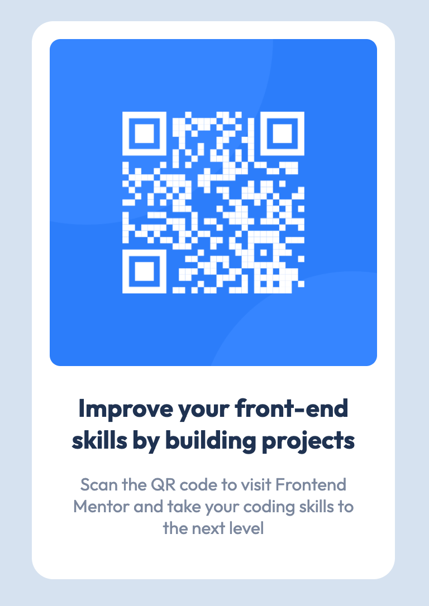

# Frontend Mentor - QR code component solution

This is a solution to the [QR code component challenge on Frontend Mentor](https://www.frontendmentor.io/challenges/qr-code-component-iux_sIO_H). Frontend Mentor challenges help you improve your coding skills by building realistic projects. 

## Table of contents

- [Overview](#overview)
  - [The challenge](#the-challenge)
  - [Screenshot](#screenshot)
  - [Links](#links)
- [My process](#my-process)
  - [Built with](#built-with)
  - [What I learned](#what-i-learned)
  - [Continued development](#continued-development)
  - [Useful resources](#useful-resources)
- [Author](#author)
<!-- - [Acknowledgments](#acknowledgments) -->

## Overview

### The challenge

Users should be able to:

- View the optimal layout for the app depending on their device's screen size
- See hover states for all interactive elements on the page
- Select and submit a number rating
- See the "Thank you" card state after submitting a rating

### Screenshot



### Links

- Solution URL: [github.com/johnmal-dev/qr-code-component](https://github.com/johnmal-dev/qr-code-component)
- Live Site URL: [johnmal-qr-code-component.netlify.app](https://johnmal-qr-code-component.netlify.app/)

## My process

### Built with

- Semantic HTML5 markup
- CSS custom properties
- Flexbox
- Mobile-first workflow
- PureRef Images App
- Less CSS

### What I learned
- How to use Less CSS
```css
body {
  ...
  .container {
    ...
    .card {
      ...
    }
  }
}
```
- How to implement Less CSS Variables
```css
@light-gray: hsl(212, 45%, 89%);
@grayish-blue: hsl(220, 15%, 55%);
@dark-blue: hsl(218, 44%, 22%);
```


### Continued development

An example video used SCSS CSS preprocessor. Without a CSS preprocessor, my code was less organized. For my next project, I will use the Less CSS extension.

### Useful resources

- [PureRef](https://www.pureref.com/) - This helped me compare my work to the provided example images. I really liked this app and will use it going forward.
- [Less CSS](https://lesscss.org/) - Less (which stands for Leaner Style Sheets) is a backwards-compatible language extension for CSS. This made for a quicker, cleaner CSS coding experience.
- [Koala App](http://koala-app.com/) - Koala is a GUI application for Less (and other preprocessors!) that automatically converts my .less files to .css files.

## Author

- Website - [John Malapit](https://www.johnmal.dev)
- Frontend Mentor - [@johnmal-dev](https://www.frontendmentor.io/profile/johnmal-dev)
- Twitter - [@johnmal_dev](https://www.twitter.com/johnmal_dev)

<!-- ## Acknowledgments -->